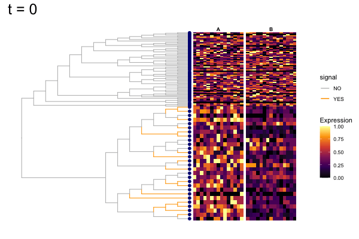

```{r}
knitr::opts_chunk$set(echo = TRUE, warning=FALSE, message = FALSE)
```


# Data simulation

```{r}
suppressPackageStartupMessages({
  library(ggplot2)
  library(ggtree)
  library(dplyr)
  library(treeclimbR)  
  library(TreeSummarizedExperiment)
  library(ape)
  library(cowplot)
  library(scales)
  library(TreeHeatmap)
  library(gganimate)
  library(ggnewscale)
})
```

## Data

A random tree.
```{r}
set.seed(2020)
n <- 100
tr <- rtree(n)
```

```{r}
# generate a random probability vector for leaves
p <- runif(n = n, 0, 1)
p <- p/sum(p)
names(p) <- tr$tip.label
```

Here, some leaves are selected to have differences between groups. 
```{r}
# Leaves are selected from the same branch to simplify the visualtion later (e.g., zoom in)
df <- selNode(pr = p, tree = tr, all = TRUE)
nd <- df %>%
  filter(numTip > 20 & numTip < 30) %>%
  top_n(1) %>%
  select(nodeNum) %>%
  unlist()

# random select 18 leaves from the branch
m <- 18
lf <- unlist(findOS(tree = tr, node = nd, only.leaf = TRUE))
lfs <- sample(lf, size = m, replace = FALSE)
lfs <- transNode(tree = tr, node = lfs)
```


```{r}

# samples in two groups
nSam <- c(15, 15)
gr <- rep(LETTERS[1:2], nSam)

# fold change
fc <- 2

# counts
count <- rmultinom(n = sum(nSam), size = 500, prob = p)
rownames(count) <- names(p)

# multiply counts of selected leaves with 3 in the first group
count[lfs, seq_len(nSam[1])] <- count[lfs, nSam[1]+seq_len(nSam[1])]*fc
colnames(count) <- paste(gr, seq_len(sum(nSam)), sep = "_")

```


The tree and count table are stored as a `TSE` object.
```{r}
# build TSE
lse <- TreeSummarizedExperiment(assays = list(count),
                                colData = data.frame(group = gr),
                                rowTree = tr)
```


## Viz data


```{r}

# color branch
nds <- signalNode(tree = tr, node = lfs)
br <- unlist(findOS(tree = tr, node = nds,
                    only.leaf = FALSE, self.include = TRUE))
df_color <- data.frame(node = showNode(tree = tr, only.leaf = FALSE)) %>%
  mutate(signal = ifelse(node %in% br, "YES", "NO"))
fig_0 <- ggtree(tr = tr, layout = "rectangular", 
              branch.length = "none", 
              aes(color = signal)) %<+% df_color +
  scale_color_manual(values = c("NO" = "grey", "YES" = "orange"))
fig_1 <- scaleClade(fig_0, node = nd, scale = 4)

# counts
count <- assays(lse)[[1]]

# scale counts
scale_count <- t(apply(count, 1, FUN = function(x) {
    xx <- x
    rx <- (max(xx)-min(xx))
    (xx - min(xx))/max(rx, 1)
}))
rownames(scale_count) <- rownames(count)
colnames(scale_count) <- colnames(count)


# fig: tree + heatmap
vv <- gsub(pattern = "_.*", "", colnames(count))
names(vv) <- colnames(scale_count)
fig <- TreeHeatmap(tree = tr, tree_fig = fig_1, hm_data = scale_count,
                   column_split = vv, rel_width = 0.6, tree_hm_gap = 0.3) +
    scale_fill_viridis_c(option = "B")
fig
```


# Data aggregation

```{r}
all_node <- showNode(tree = tr, only.leaf = FALSE)
tse <- aggValue(x = lse, rowLevel = all_node, FUN = sum)
```


# Differential analysis

wilcoxon sum rank test is peformed on all nodes

```{r}
# wilcox.test
test.func <- function(X, Y) {  
    Y <- as.numeric(factor(Y))
    obj <- apply(X, 1, function(x) {                
        p.value <- suppressWarnings(wilcox.test(x ~ Y)$p.value)
        e.sign <- sign(mean(x[Y == 2]) - mean(x[Y == 1]))
        c(p.value, e.sign)          
    })
    return(list(p.value=obj[1, ], e.sign=obj[2, ])) 
}
Y <- colData(tse)$group
X <- assays(tse)[[1]]
resW <- test.func(X,Y)
outW <- data.frame(node = rowLinks(tse)$nodeNum,
                   pvalue = resW$p.value,
                   sign = resW$e.sign)
```

# run `treeclimbR`

```{r}
# get candidates
cand <- getCand(tree = rowTree(tse), score_data = outW, 
                node_column = "node", p_column = "pvalue",
                threshold = 0.05,
                sign_column = "sign", message = TRUE)


```


```{r}
# evaluate candidates
best <- evalCand(tree = tr, levels = cand$candidate_list, 
                 score_data = outW, node_column = "node",
                 p_column = "pvalue", sign_column = "sign")
infoCand(object = best)

outB <- topNodes(object = best, n = Inf, p_value = 0.05)

```

# Results

## Candidates
```{r}
# number of nodes in each candidate
candL <- cand$candidate_list
unlist(lapply(candL, length))
```

```{r message = FALSE, warning = FALSE, results = FALSE, eval= FALSE}
# tree
leaf <- showNode(tree = tr, only.leaf = TRUE)
nleaf <- length(leaf)

# the candidate list + results
t <- names(candL)
nt <- length(candL)
mm <- matrix(NA, nrow = nleaf, ncol = nt)
colnames(mm) <- paste("row_", seq_len(nt), sep = "")

#
path <- matTree(tree = tr)
r1 <- lapply(leaf, FUN = function(x) {
    which(path == x, arr.ind = TRUE)[, "row"]
})

for (j in seq_len(nt)) {
    rj <- lapply(candL[[j]], FUN = function(x) {
        which(path == x, arr.ind = TRUE)[, "row"]
    })
    
    for (i in seq_len(nleaf)) {
        # leaf i: which row of `path`   
        ni <- r1[[i]]
        ul <- lapply(rj, FUN = function(x) {
            any(ni %in% x)
        })
        
        # the ancestor of leaf i: which node in candidate j
        ll <- which(unlist(ul))
        if (length(ll) == 1) {
            mm[i, j] <- ll
        }
    }}


nn <- lapply(seq_len(ncol(mm)), FUN = function(x) {
    mx <- mm[, x]
    xx <- candL[[x]][mx]
    cbind.data.frame(xx, rep(t[x], length(xx)), 
                     stringsAsFactors = FALSE)
})

df <- do.call(rbind.data.frame, nn)
colnames(df) <- c("node", "threshold")
head(df)

pd <- df %>%
    left_join(y = fig_1$data, by = "node") %>%
    select(threshold, x, y) %>%
    mutate(t = factor(threshold, levels = names(candL)))


gif_signal <- fig + 
    geom_point(data = pd, aes(x, y),
               color = "navy", size = 2) +
    theme(plot.title = element_text(size = 25)) +
    transition_states(states = t, 
                      state_length = 8,
                      transition_length = 2,
                      wrap = FALSE) +
    shadow_wake(wake_length = 0.1, alpha = FALSE, 
                wrap = FALSE) +
    labs(title = "t = {closest_state}") +
    enter_fade() +
    exit_fade()

anim_save("output/signal_cands.gif", gif_signal, 
          height = 400, width = 600)


```



Candidates are saved as `Supplenmentary Figure 8` of the `treeclimbR` manuscript: 
```{r}
candL <- cand$candidate_list
unlist(lapply(candL, length))

figL <- lapply(seq_along(candL), FUN = function(x) {
cand.x <- candL[[x]]
fig.x <- fig_1 +
  geom_point2(aes(subset = (node %in% cand.x)), color = "navy", size = 0.5) +
  labs(title = names(candL)[x]) +
  theme(legend.position = "none",
        plot.title = element_text(color="navy", size=7, 
                                  hjust = 0.5, vjust = -0.08))
  #print(fig.x)
})

legend <- get_legend(fig_1)
plot_grid(plotlist = c(figL, list(legend)), nrow = 3,
          labels = paste0(letters[seq_along(candL)], "."), 
          label_size = 9, label_y = 0.99)
ggsave(filename = "output/Supplementary_toy_cand.eps", 
       width = 8, height = 8, units = "in")
```

## treeclimbR VS BH

Nodes that are detected to have different values (signal) between two groups are labeled as red points. Branches that truly have signal are colored in orange.

```{r}
# by treeclimbR
(loc_tree <- outB$node)

# by BH
leaf <- showNode(tree = tr, only.leaf = TRUE)
loc_bh <- outW %>% 
  filter(node %in% leaf) %>%
  mutate(p_adj = p.adjust(pvalue, method = "BH")) %>%
  filter(p_adj <= 0.05) %>%
  select(node) %>%
  unlist()

```


```{r}
final_1 <- fig_1 +
  geom_point2(aes(subset = node %in% loc_tree),
              color = "red")
final_2 <- fig_1 +
  geom_point2(aes(subset = node %in% loc_bh),
              color = "navy")


df_pie <- fig$data %>%
  filter(node %in% c(loc_bh, loc_tree)) %>%
  mutate(a = node %in% loc_tree,
         b = node %in% loc_bh, 
         treeclimbR = a/(a+b),
         BH = b/(a+b)) %>%
  select(node, treeclimbR, BH)
pie <- nodepie(df_pie, cols=2:3,  
                    color = c("treeclimbR" = "red", "BH" = "navy"))
final_3 <- fig_1 +
  geom_inset(pie, width = 0.15, height = 0.15)


final_cb <- plot_grid(final_1 +
                        theme(legend.position = "none"), 
                      final_2 +
                        theme(legend.position = "none"),
                      labels = c("treeclimbR", "BH"), 
                      label_size = 9, label_x = c(-0.1, 0),
                      nrow = 2)
plot_grid(final_cb, final_3, rel_widths = c(0.8, 1),
          labels = c("", "treeclimbR VS BH"), 
          label_size = 9, label_x = c(0, -0.1))
ggsave("output/signal_result.png", width = 6.13, height = 4.56)
```


